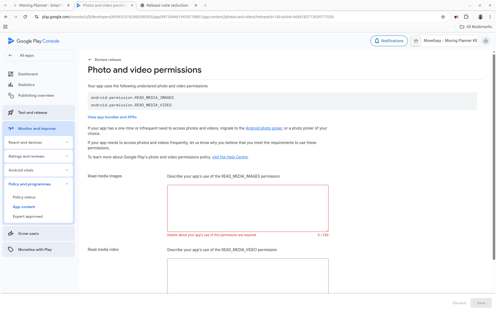

# Google Play Store Submission Guide - MoveLink

## 📋 Pre-Submission Checklist

### ✅ Files Ready
- [x] Release AAB: `android/app/build/outputs/bundle/release/app-release.aab` (3.4 MB)
- [x] App Icon: `play-store-icon.png` (512x512)
- [ ] Feature Graphic: 1024x500 (needs creation)
- [ ] Screenshots: Minimum 2 per device type
- [ ] Privacy Policy URL
- [ ] App Description (short and full)

---

## 🎯 Step-by-Step Submission Process

### Step 1: Create Google Play Console Account

1. **Go to:** https://play.google.com/console
2. **Sign in** with your Google account
3. **Pay registration fee:** $25 USD (one-time, lifetime access)
4. **Complete account setup:**
   - Developer name: "MoveLink" or your company name
   - Contact email: support@movelink.co.ke
   - Website: https://movelink.co.ke (or current domain)
   - Phone number: +254 XXX XXX XXX

---

### Step 2: Create New App

1. Click **"Create app"** button
2. Fill in app details:

**App Details:**
```
App name: MoveLink - Kenya Moving Planner
Default language: English (United States)
App or game: App
Free or paid: Free
```

**Declarations:**
- [x] I confirm this app complies with Google Play's policies
- [x] I confirm this app complies with US export laws

3. Click **"Create app"**

---

### Step 3: Complete App Dashboard Setup

#### 3.1 Store Listing

**Navigate to:** Dashboard → Store presence → Main store listing

**App Details:**
```
App name: MoveLink - Kenya Moving Planner

Short description (max 80 chars):
Connect with trusted movers in Kenya. Get instant quotes & book securely.

Full description (max 4000 chars):
🚚 MoveLink - Your Trusted Moving Partner in Kenya

MoveLink connects you with verified, professional moving companies across Kenya. Whether you're relocating your home or office, get instant quotes, compare prices, and book trusted movers - all in one place.

✨ KEY FEATURES:

📱 Instant Quotes
• Get quotes from multiple movers in minutes
• Compare prices and services side-by-side
• No obligation, completely free

🔍 Find Verified Movers
• Browse profiles of licensed moving companies
• Read verified customer reviews
• Check ratings and past performance

📋 Easy Booking
• Book directly through the app
• Secure payment options
• Real-time booking confirmations

💬 Direct Communication
• Chat with movers directly
• Get instant answers to your questions
• Share details about your move

⭐ Rate & Review
• Share your moving experience
• Help others make informed decisions
• Build a trustworthy community

📍 Location-Based Search
• Find movers near you
• Coverage across major Kenyan cities
• Nairobi, Mombasa, Kisumu & more

🔐 Safe & Secure
• Verified moving companies
• Secure payment processing
• Your data is protected

WHY CHOOSE MOVELINK?

✓ Save Time: Get multiple quotes in minutes, not days
✓ Save Money: Compare prices to get the best deal
✓ Peace of Mind: All movers are verified and rated
✓ Transparent Pricing: No hidden fees or surprises
✓ Customer Support: We're here to help every step

PERFECT FOR:

• Home relocations
• Office moves
• Apartment moving
• Furniture transport
• Interstate moves
• Storage solutions

Join thousands of Kenyans who trust MoveLink for their moving needs. Download now and experience stress-free moving!

📧 Contact: support@movelink.co.ke
🌐 Website: https://movelink.co.ke

MoveLink - Moving Made Easy in Kenya 🇰🇪
```

**App icon:**
- Upload: `play-store-icon.png` (512x512, PNG)

**Graphics (Required):**

**Phone Screenshots (minimum 2, maximum 8):**
- Size: 16:9 or 9:16 aspect ratio
- Min dimension: 320px
- Max dimension: 3840px
- Format: PNG or JPEG

To take screenshots:
1. Install app on device: `adb install android/app/build/outputs/apk/release/app-release.apk`
2. Take screenshots of:
   - Home screen with quote form
   - Browse movers screen
   - Mover profile page
   - Quote results/comparison
   - User profile/dashboard
   - Review submission screen

**Feature Graphic (REQUIRED):**
- Size: 1024x500 pixels
- Format: PNG or JPEG
- Max size: 1MB
- Should showcase your brand and key feature

To create feature graphic:
```bash
# Use GIMP, Canva, or Figma to create 1024x500 image
# Include:
# - MoveLink logo
# - Tagline: "Moving Made Easy in Kenya"
# - Key visual (truck, moving boxes)
# - Brand colors (orange/cream/teal)
```

**Categorization:**
```
App category: Business
Tags (optional): moving, logistics, transportation, kenya, movers
```

**Contact details:**
```
Email: support@movelink.co.ke
Phone: +254 XXX XXX XXX (optional)
Website: https://movelink.co.ke
```

**Privacy Policy:**
- URL: https://movelink.co.ke/privacy-policy
- (You need to create this page)

#### 3.2 Store Settings

**Navigate to:** Store presence → Store settings

**App details:**
```
App name: MoveLink
Developer name: MoveLink (or your company)
```

**Contact details:**
```
Email: support@movelink.co.ke
Website: https://movelink.co.ke
External marketing: Yes (optional)
```

#### 3.3 Main Store Listing Countries

**Navigate to:** Store presence → Main store listing → View countries

**Primary country:** Kenya

**Additional countries (optional):**
- Uganda
- Tanzania
- Rwanda
- Rest of Africa (expand gradually)

---

### Step 4: App Content

**Navigate to:** Policy → App content

#### 4.1 Privacy Policy
```
Privacy policy URL: https://movelink.co.ke/privacy-policy
```

#### 4.2 App Access
```
All or some functionality is restricted: No
```

#### 4.3 Ads
```
Contains ads: No
```

#### 4.4 Content Ratings
Click **"Start questionnaire"**

Answer questions honestly:
```
App category: Utility
Violence: None
Sexual content: None
Language: None
Controlled substances: None
Gambling: None
Other: None
```

You'll receive ratings from various boards (ESRB, PEGI, etc.)

#### 4.5 Target Audience
```
Target age: 18+ (adults)
```

#### 4.6 News App
```
Is this a news app: No
```

#### 4.7 COVID-19 Contact Tracing and Status App
```
Is this app related to COVID-19: No
```

#### 4.8 Data Safety

**Data collection:**
```
Does your app collect or share user data: Yes
```

**Data types collected:**
- Location (approximate)
- Name
- Email address
- Phone number
- Photos (optional - for mover profiles)

**Data usage:**
- App functionality
- Account management
- Customer support

**Data sharing:**
- Shared with movers when booking
- Not sold to third parties

**Security practices:**
- Data encrypted in transit
- Users can request data deletion
- Committed to Google Play Families Policy

---

### Step 5: Create Production Release

**Navigate to:** Release → Production → Create new release

#### 5.1 Upload App Bundle

1. Click **"Upload"**
2. Select: `android/app/build/outputs/bundle/release/app-release.aab`
3. Wait for upload (3.4 MB)
4. Google will analyze the bundle (takes 1-2 minutes)

#### 5.2 Release Details

**Release name:**
```
1.0.0 - Initial Release
```

**Release notes (English):**


#### 5.3 Rollout

**Choose rollout percentage:**
- 100% - Full release (recommended for first release)
- Or start with 20% and increase gradually

---

### Step 6: Review and Publish

1. **Review all sections:**
   - Store listing ✓
   - App content ✓
   - Production release ✓
   - Pricing & distribution ✓

2. **Set Pricing & Distribution:**
   ```
   Price: Free
   Countries: Kenya (and other selected countries)
   Content rating: As assigned
   ```

3. **Submit for review:**
   - Click **"Save"** on the release
   - Click **"Review release"**
   - Check for any errors or warnings
   - Click **"Start rollout to Production"**

4. **Wait for approval:**
   - Initial review: 1-3 days typically
   - You'll receive email updates
   - Can take up to 7 days for first submission

---

## 📸 Creating Required Graphics

### Screenshots (Use ADB or Emulator)

**Recommended pages to screenshot:**
1. **Home/Quote Form** - Shows main functionality
2. **Browse Movers** - Shows mover listings
3. **Mover Profile** - Shows detailed mover info
4. **Quote Results** - Shows quote comparison
5. **User Profile** - Shows user features

**Tools:**
- **ADB:** `adb shell screencap -p /sdcard/screenshot.png && adb pull /sdcard/screenshot.png`
- **Android Studio:** Built-in screenshot tool
- **Device:** Use phone's screenshot feature

### Feature Graphic (1024x500)

**Option 1: Use Canva (Recommended)**
1. Go to canva.com
2. Create custom size: 1024x500
3. Add elements:
   - Background: Orange/cream gradient
   - MoveLink logo (centered left)
   - Moving truck illustration
   - Text: "Moving Made Easy in Kenya"
   - Phone mockup with app screenshot (optional)

**Option 2: Use GIMP/Photoshop**
1. New file: 1024x500 px, 72 DPI
2. Design with brand colors
3. Export as PNG

**Option 3: Hire designer**
- Fiverr, Upwork (~$10-30)
- Provide brand assets and requirements

---

## 🌐 Required: Privacy Policy Page

You MUST create a privacy policy page before submission.

**Quick solution - Use generator:**
1. Go to: https://www.privacypolicygenerator.info/
2. Fill in:
   - Website name: MoveLink
   - Website URL: https://movelink.co.ke
   - App type: Mobile app
   - Collect: Name, email, location, phone
   - Purpose: Service delivery, account management
3. Generate and download
4. Host at: https://movelink.co.ke/privacy-policy

**Or create custom page** with these sections:
- Information we collect
- How we use information
- Data sharing (with movers only)
- Data security
- User rights (access, deletion)
- Contact information

---

## ⚠️ Common Rejection Reasons & Solutions

### 1. Missing Privacy Policy
**Error:** "Your app must have a privacy policy"
**Solution:** Host privacy policy and add URL

### 2. Incomplete Store Listing
**Error:** "Missing required graphics"
**Solution:** Add all required screenshots and feature graphic

### 3. Misleading Content
**Error:** "App description doesn't match functionality"
**Solution:** Ensure screenshots match description

### 4. Inappropriate Content
**Error:** Content rating issues
**Solution:** Review and update content rating questionnaire

### 5. Permissions Not Justified
**Error:** "Location permission not clearly explained"
**Solution:** Add explanation in app and store listing

---

## 📊 Post-Submission

### Monitor Review Status

1. **Check Play Console dashboard:**
   - Status updates appear in real-time
   - Email notifications sent

2. **Review statuses:**
   - ⏳ **Pending** - Under review
   - ⚠️ **Changes requested** - Need to fix issues
   - ✅ **Approved** - Ready to publish
   - ❌ **Rejected** - Need to address violations

### After Approval

1. **App goes live** within hours of approval
2. **Monitor metrics:**
   - Installs
   - Ratings
   - Reviews
   - Crash reports

3. **Respond to reviews:**
   - Reply to user feedback
   - Address issues quickly
   - Build community trust

4. **Plan updates:**
   - Bug fixes
   - New features
   - Regular maintenance

---

## 🔄 Future Updates

### To Release Version 1.0.1:

1. Update version in `android/app/build.gradle`:
   ```gradle
   versionCode 2
   versionName "1.0.1"
   ```

2. Build new release:
   ```bash
   npm run build
   npx cap sync android
   cd android && ./gradlew bundleRelease
   ```

3. Upload to Play Console:
   - Production → Create new release
   - Upload new AAB
   - Add release notes
   - Roll out

---

## 📞 Support & Resources

**Play Console Help:**
- https://support.google.com/googleplay/android-developer

**Policy Guidelines:**
- https://play.google.com/about/developer-content-policy/

**Google Play Academy:**
- https://playacademy.exceedlms.com/student/catalog

**MoveLink Support:**
- Email: support@movelink.co.ke
- GitHub: https://github.com/dmuchai/kenya-movers-ai

---

## ✅ Quick Checklist

Before clicking "Start rollout to Production":

- [ ] App name and icon set
- [ ] Short and full descriptions written
- [ ] Minimum 2 screenshots uploaded
- [ ] Feature graphic (1024x500) uploaded
- [ ] Privacy policy URL added
- [ ] Content rating completed
- [ ] Data safety form completed
- [ ] Target audience selected
- [ ] Countries selected (Kenya)
- [ ] Release notes written
- [ ] AAB uploaded successfully
- [ ] All warnings addressed
- [ ] Pricing set to Free

**Once all checked, you're ready to submit!** 🚀

---

Good luck with your submission! The app looks great and should be approved quickly. 🎉
